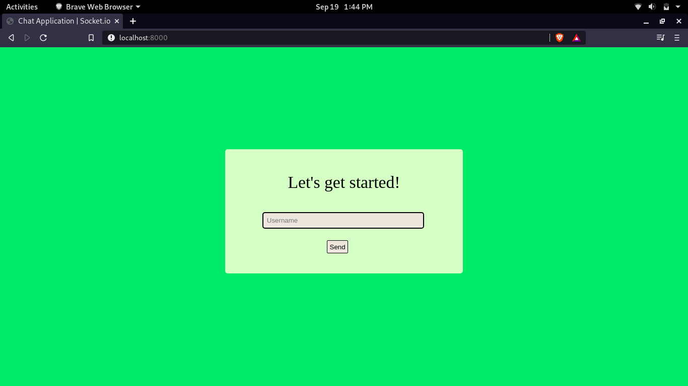
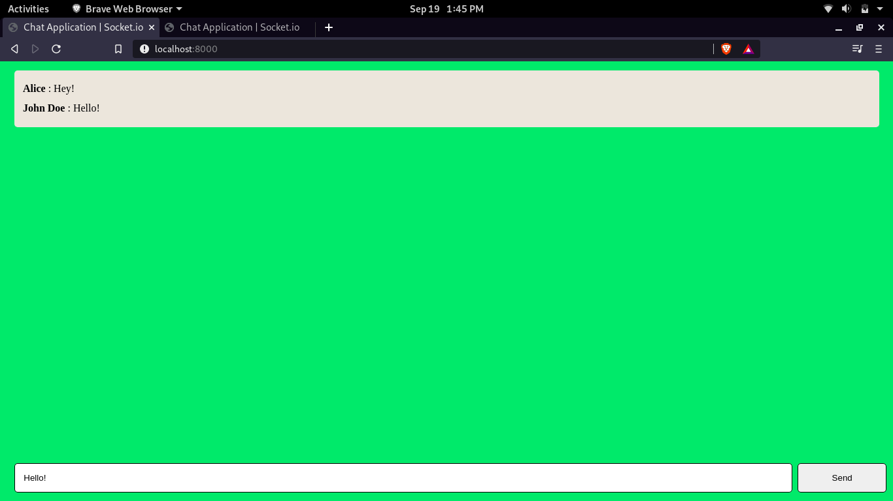

# Chat Application using Socket.io and ExpressJS

A chat application implemented using Socket.io and ExpressJS.

### To run :

`nodemon App`

### Installations :

#### 1. Socket.io : 

    `npm install socket.io`

#### 2. ExpressJS :

    `npm install express`

#### 3. Nodemon :

    `npm install nodemon`

### Application UI :

Set up a username!

Start Chatting!

